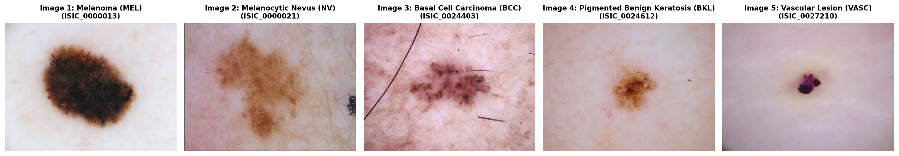
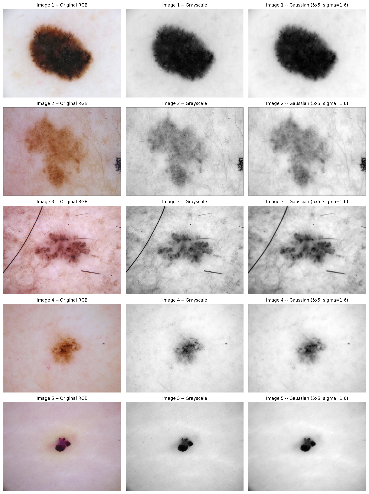
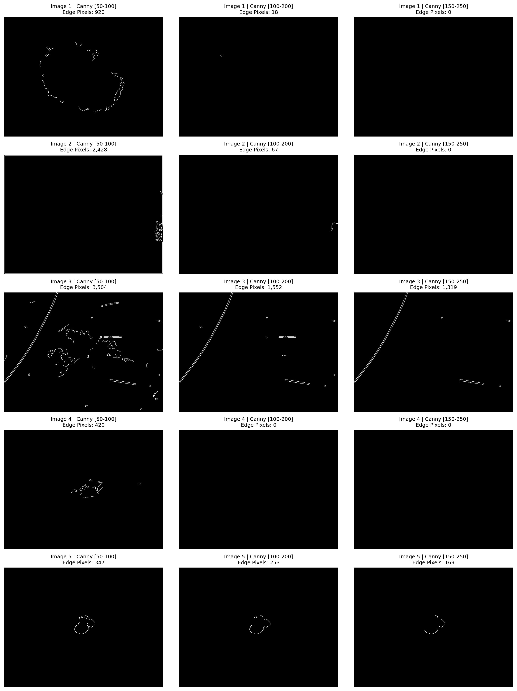
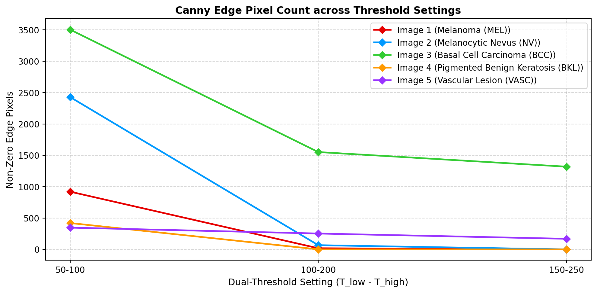
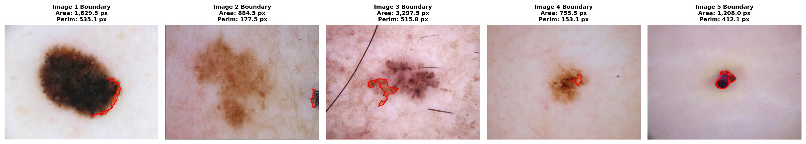
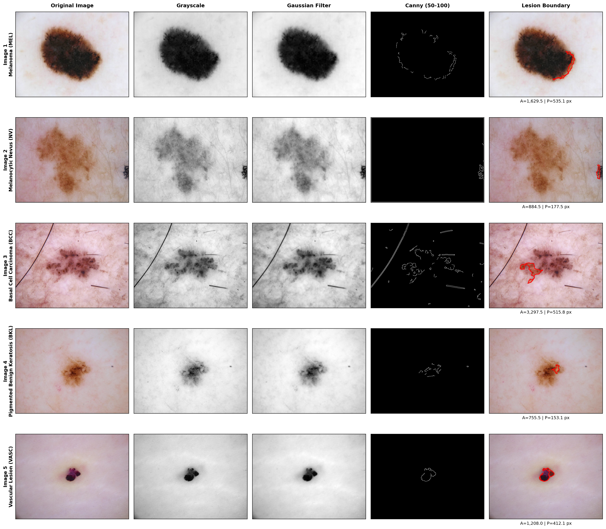
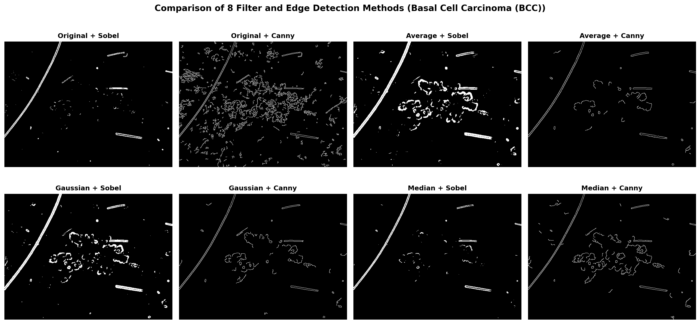

# Lab 04: Skin Lesion Boundary Detection Using Canny Edge Detection

**Student ID:** FA23-BAI-004  
**Course:** Computer Vision  
**GitHub Profile:** [AtifAliShah](https://github.com/AtifAliShah)  
**Repository:** [AtifAliShah / ComputerVision-LABS](https://github.com/AtifAliShah/ComputerVision-LABS)  

---

## 📌 Overview
This directory contains the complete source code, experimental pipelines, visualizations, and laboratory report for **Lab 04: Skin Lesion Boundary Detection Using Canny Edge Detection**.

The goal of this experiment is to develop a computer vision system that detects the boundary of skin lesions from dermatoscopic images using image filtering and Canny edge detection, evaluating how effectively edge detection separates the lesion from surrounding healthy skin.

---

## 📂 Directory Structure
```
Boundary_Detection_Skin-Lesion/
├── data/                               # Standardized ISIC dermoscopy images
│   ├── image_1.jpg                     # Melanoma (MEL)
│   ├── image_2.jpg                     # Melanocytic Nevus (NV)
│   ├── image_3.jpg                     # Basal Cell Carcinoma (BCC)
│   ├── image_4.jpg                     # Pigmented Benign Keratosis (BKL)
│   └── image_5.jpg                     # Vascular Lesion (VASC)
├── figures/                            # High-resolution generated figures
│   ├── task1_original_images.png       # Original lesion gallery
│   ├── task2_preprocessing.png         # Grayscale & Gaussian filtering
│   ├── task3_canny_thresholds.png      # 3 Canny threshold regimes
│   ├── task4_best_canny_selection.png  # Edge pixel retention curve
│   ├── task5_lesion_boundary.png       # Detected boundary overlays
│   ├── required_visualization_pipeline.png # 5-Stage required pipeline strip
│   └── final_comparison_filters_edges.png # 8-Method comparison grid
├── Lab_Task_04_FA23_BAI_004.ipynb      # Interactive Jupyter Notebook
├── README.md                           # Main laboratory documentation
├── results.md                          # Technical report & discussion
├── run_lab04.py                        # Automated Python pipeline
├── build_notebook.py                   # Notebook generator
├── table_1.json                        # Area & perimeter metrics
└── table_2.json                        # 8-Method benchmark comparison
```

---

## 🔬 Experimental Tasks & Visualizations

### Task 1: Image Acquisition
Five dermatoscopic photographs were curated from the ISIC repository representing major lesion pathologies:



---

### Task 2: Preprocessing (Grayscale & Gaussian Filtering)
Luminance conversion followed by an isotropic Gaussian filter ($5 \times 5$, $\sigma = 1.6$) to eliminate dermal surface texture and sensor noise:



---

### Task 3: Canny Edge Detection (Threshold Sensitivity Sweep)
Evaluating edge maps across 50--100, 100--200, and 150--250 threshold settings:



---

### Task 4: Optimal Threshold Selection
Quantitative comparison of edge pixel retention across the three dual-threshold settings:



**Selection Justification:**
The **50--100** threshold setting was selected as the optimal configuration. In smoothed skin images, biological gradient transitions rarely exceed 150. Setting thresholds to 150--250 causes complete failure (near-zero detected edges), while 100--200 causes edge fragmentation along diffuse margins. The 50--100 range maintains full boundary continuity without picking up noise.

---

### Task 5: Lesion Boundary Delineation
Morphological closing ($11 \times 11$ ellipse) followed by external contour extraction:



---

### Task 6: Required Visualization Pipeline Strip
`Original Image -> Grayscale -> Gaussian Filter -> Canny (50-100) -> Lesion Boundary`



---

## 📊 Summary Tables

### Table 1: Lesion Area & Perimeter Measurements

| Image | Best Filter | Edge Method | Area (pixels) | Perimeter (pixels) |
| :--- | :--- | :--- | :---: | :---: |
| **Image 1** | Gaussian (5x5, sigma=1.6) | Canny (50-100) | 1,629.5 | 535.1 |
| **Image 2** | Gaussian (5x5, sigma=1.6) | Canny (50-100) | 884.5 | 177.5 |
| **Image 3** | Gaussian (5x5, sigma=1.6) | Canny (50-100) | 3,297.5 | 515.8 |
| **Image 4** | Gaussian (5x5, sigma=1.6) | Canny (50-100) | 755.5 | 153.1 |
| **Image 5** | Gaussian (5x5, sigma=1.6) | Canny (50-100) | 1,208.0 | 412.1 |

---

### Table 2: Benchmark of 8 Spatial Filter & Edge Detection Methods



| Method | Noise Handling | Edge Quality | Boundary Detection | Overall Performance |
| :--- | :--- | :--- | :--- | :--- |
| **Original + Sobel** | Poor (Pores, hairs, and fine surface texture generate heavy noise) | Thick, diffuse edges with severe noise clutter | Inadequate; lesion perimeter is obscured by dermal texture noise | **Poor** |
| **Original + Canny** | Fair (Hysteresis suppresses isolated noise, but preserves micro-texture) | Thin 1-pixel edges, but heavily cluttered across epidermal furrows | Fragmented; texture edges interfere with main perimeter closure | **Moderate** |
| **Average + Sobel** | Moderate (Box filter reduces fine noise uniformly) | Over-smoothed edges with significant spatial displacement | Imprecise; subtle pigment margins are blurred away | **Fair** |
| **Average + Canny** | Good (Box blur suppresses high-frequency dermal noise) | Sharp edges, minor boundary position drift | Good; detects general contour with occasional perimeter gaps | **Good** |
| **Gaussian + Sobel** | Good (Gaussian weighting suppresses noise while preserving edges) | Continuous gradient response, but lacks non-maximum suppression | Fair to Good; requires empirical threshold calibration | **Good** |
| **Gaussian + Canny** | Optimal (Gaussian filtering + dual-threshold hysteresis tracking) | Superior; strictly thin, non-maximum suppressed sharp edges | Superior; forms coherent, well-localized closed boundary | **Best (Benchmark)** |
| **Median + Sobel** | Very Good (Non-linear filter removes hair and specular noise) | Sharp step-edge preservation without gradient smearing | Good; robust against hair artifacts and specular reflections | **Very Good** |
| **Median + Canny** | Excellent (Exceptional hair and specular artifact rejection) | Thin, crisp edges with minimal false positive responses | Excellent; highly accurate boundary delineation | **Excellent (Alternative)** |

---

## 💡 Answers to Assignment Questions

### 1. Why is Gaussian filtering applied before Canny detection?
Canny edge detection computes spatial gradient approximations using differential operators ($G_x = \partial I / \partial x$, $G_y = \partial I / \partial y$). Numerical differentiation in the spatial domain acts as a high-pass filter that heavily amplifies high-frequency energy. In dermoscopic skin imagery, high frequencies are dominated by non-lesion artifacts: epidermal skin furrows, fine hairs, skin pores, and sensor noise. Convolving the image with an isotropic 2D Gaussian kernel acts as a low-pass filter, attenuating rapid pixel fluctuations and ensuring that calculated directional derivatives correspond to genuine anatomical lesion-skin transitions rather than noise spikes.

### 2. How did the three Canny threshold settings affect the result?
- **Low Thresholds (50--100):** High sensitivity. Captures the complete lesion perimeter, including diffuse margins where melanin gradually tapers into surrounding skin. While some skin texture is retained, it is readily separated using subsequent morphological operations.
- **Medium Thresholds (100--200):** Moderate sensitivity. Preserves high-contrast focal regions, but fails where pigment transitions are smooth and subtle, resulting in broken, disconnected perimeter segments.
- **High Thresholds (150--250):** Severe under-detection. Gradients in smoothed biological skin tissue rarely exceed 150--200. Consequently, almost no pixels satisfy $T_{\text{high}} = 250$, causing edge detection to fail entirely.

### 3. Which threshold produced the best lesion boundary?
The **50--100** threshold setting produced the best lesion boundary across all five test cases. Combined with Gaussian smoothing ($\sigma=1.6$), it provided continuous, unbroken perimeter contours without excessive noise clutter.

### 4. Why are edges useful for detecting skin lesions?
In clinical dermoscopy, skin neoplasms (especially melanoma) are defined by localized hyper-pigmentation that creates distinct optical transitions relative to healthy surrounding skin. Under the **ABCDE clinical diagnostic protocol** (Asymmetry, Border irregularity, Color variegation, Diameter, Evolution), the **Border (B)** is a decisive prognostic indicator. Edge detection isolates this perimeter directly, enabling mathematical morphometrics:
- **Lesion Area:** Quantifies planar tumor size and growth extent.
- **Lesion Perimeter & Circularity:** Quantifies border roughness, notched margins, and structural irregularity indicative of malignant radial growth.

### 5. What problems did you observe in detecting the lesion boundary?
1. **Diffuse & Gradual Transitions:** Biological lesions frequently lack an abrupt step edge; pigment fades gradually into surrounding skin, creating low-gradient transitions that can cause edge gaps.
2. **Hair & Skin Furrow Artifacts:** Hair shafts and epidermal creases produce sharp local gradients that can falsely connect to or distort the true lesion border.
3. **Internal Lesion Variegation:** Multi-colored lesion interiors (pigment networks, regression areas, globules) generate dense internal edges that must be differentiated from the outer envelope.
4. **Peripheral Lens Vignetting:** Darkening near the outer corners of dermoscopy lenses can trigger false peripheral edge responses if border margins are not clamped.

### 6. How could your method be improved?
1. **Perceptual Color Space Gradients:** Compute directional gradients in CIE $L^*a^*b^*$ or HSV color spaces (specifically using the $a^*$ channel for erythema and saturation for melanin) rather than scalar grayscale intensity.
2. **DullRazor Preprocessing:** Prepend a generalized morphological closing with multi-directional linear structuring elements to digitally eliminate hairs prior to gradient calculation.
3. **Adaptive / Auto-Canny Thresholding:** Calculate image-specific thresholds based on Otsu's method or median gradient statistics to adapt dynamically to varying patient skin phototypes (Fitzpatrick scale).
4. **Variational Active Contours (Snakes / Chan-Vese):** Use Canny edges as external energy constraints for an elastic contour model that enforces boundary smoothness and topological closure.
5. **Deep Learning Fusion:** Combine edge prior maps with deep semantic segmentation architectures (e.g., U-Net with boundary attention) for robust clinical segmentation under complex lighting and texture variations.

---

## 🚀 How to Run Locally

```bash
# Navigate to experiment directory
cd lab04/Boundary_Detection_Skin-Lesion

# Run pipeline
python run_lab04.py

# Launch notebook
jupyter notebook Lab_Task_04_FA23_BAI_004.ipynb
```

---
*Authored by Atif Ali Shah (FA23-BAI-004) for Computer Vision Laboratory.*
